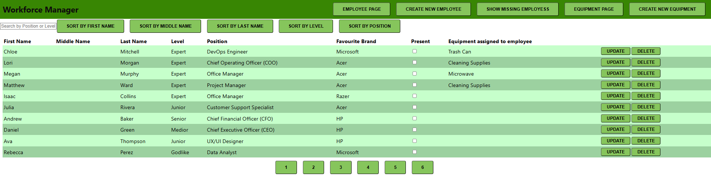
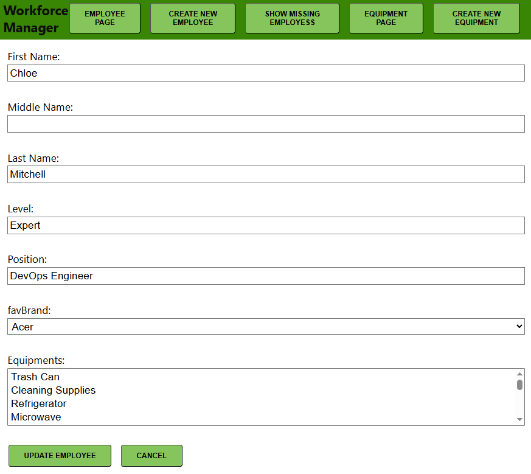

<a id="readme-top"></a>
[](https://github.com/akosszajb/WorkforceManager/stargazers)
[](https://www.linkedin.com/in/akos-szajbert-7b489126b/)

<!-- PROJECT LOGO -->
<br />
<div align="center">
  <a href="https://github.com/akosszajb/WorkforceManager">
    
  </a>

<h3 align="center">Workforce Manager - Manage employees and equipment with a simple MERN app</h3>

  <p align="center">
   A MERN app for managing workforce-related data
    <br />
    <a href="https://github.com/akosszajb/WorkforceManager"><strong>Explore the docs »</strong></a>
    <br />
    <br />
   <a href="https://github.com/akosszajb/WorkforceManager/issues/new?labels=bug&template=bug-report.md">Report Bug</a>
    ·
    <a href="https://github.com/akosszajb/WorkforceManager/issues/new?labels=enhancement&template=feature-request.md">Request Feature</a>
  </p>
</div>

<!-- TABLE OF CONTENTS -->
<details>
  <summary>Table of Contents</summary>
  <ol>
    <li>
      <a href="#project-description">Project Description</a>
      <ul>
        <li><a href="#features">Features</a></li>
        <li><a href="#built-with">Built With</a></li>
      </ul>
    </li>
    <li>
      <a href="#getting-started">Getting Started</a>
      <ul>
        <li><a href="#prerequisites">Prerequisites</a></li>
        <li><a href="#installation">Installation</a></li>
      </ul>
    </li>
    <li><a href="#license">License</a></li>
    <li><a href="#contact">Contact</a></li>
    <li><a href="#acknowledgments">Acknowledgments</a></li>
  </ol>
</details>

<!-- PROJECT DESCRIPTION-->

<div align="center">
   
   
</div>

## Project Description

Workforce Manager is a simple MERN stack application designed to help manage employee and equipment data. The project provides features for storing, updating, and deleting employee and equipment records. This app allows businesses to track workforce resources effectively.

### Features

- Manage employee data (add, edit, delete)
- Equipment management (add, edit, delete)
- CRUD functionality for both employees and equipment
- MongoDB for data storage
- REST API built with Express.js
- Simple frontend built with React

<p align="right">(<a href="#readme-top">back to top</a>)</p>

### Built With

List of the major frameworks/libraries/IDE used to bootstrap this project.

[](https://www.mongodb.com/)
[](https://expressjs.com/)
[](https://reactjs.org/)
[](https://nodejs.org/)

<p align="right">(<a href="#readme-top">back to top</a>)</p>

<!-- GETTING STARTED -->

### Getting Started

This section will guide you through setting up the Workforce Manager project locally. Follow these simple steps to get up and running.

### Prerequisites

Before you begin, make sure you have the following tools installed on your system:

- Node.js and npm installed
- MongoDB instance running (local or cloud)

Optional:

- Visual Studio Code (IDE for development)  
  Download VS Code from: https://code.visualstudio.com/

### Installation

#### Setup:

1. Clone the repository

```bash
git clone https://github.com/akosszajb/WorkforceManager
```

2. In the project folder, run the following to install the dependencies:

   ```bash
   npm install
   ```

3. Create a `.env` file to store your environment variables, such as MongoDB connection string. Example format:

   ```env
   MONGO_URL=your_mongodb_connection_string
   PORT=your_preferred_port
   ```

4. Launch the backend server from the server folder:

   ```bash
   node server.js
   ```

5. Launch the frontend script from the client folder:

   ```bash
   npm start
   ```

6. In a browser, navigate to:

   ```
   http://localhost:your_preferred_port/
   ```

Make sure both the backend and frontend servers are running.

### Test the Project:

- You can use tools like Thunder Client or Postman to test the REST API endpoints.
- Ensure the frontend is properly displaying and interacting with the API.

<p align="right">(<a href="#readme-top">back to top</a>)</p>

## License

Distributed under the MIT License. See `LICENSE.txt` for more information.

<p align="right">(<a href="#readme-top">back to top</a>)</p>

## Contact

Akos Szajbert - kisszajbert@gmail.com

[LinkedIn](https://www.linkedin.com/in/akos-szajbert-7b489126b/)

Project Link: [https://github.com/akosszajb/WorkforceManager](https://github.com/akosszajb/WorkforceManager)

<p align="right">(<a href="#readme-top">back to top</a>)</p>

## Acknowledgments

Resources I find helpful and would like to give credit to.

- [Best-README-Template](https://github.com/othneildrew/Best-README-Template)
- [W3Schools](https://www.w3schools.com/)
- [Codecool](https://codecool.com/en/)

<p align="right">(<a href="#readme-top">back to top</a>)</p>
